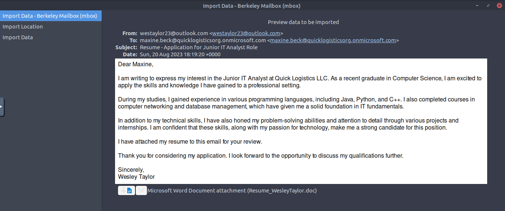
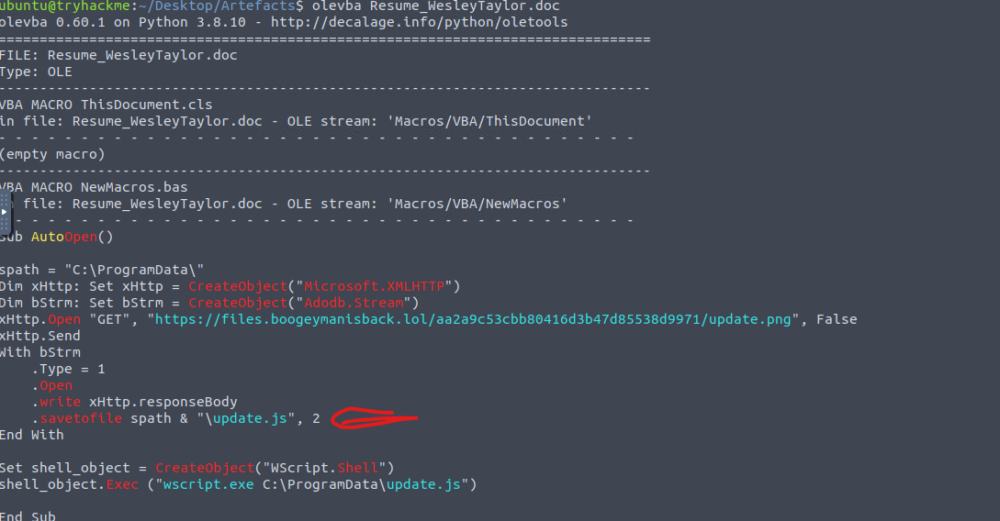
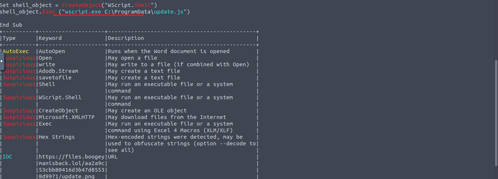
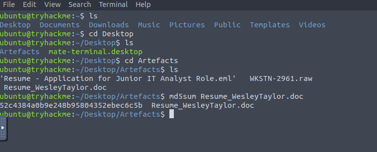
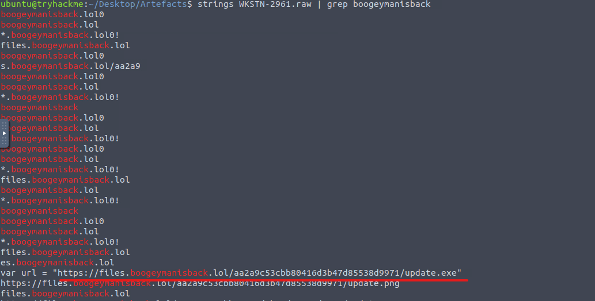
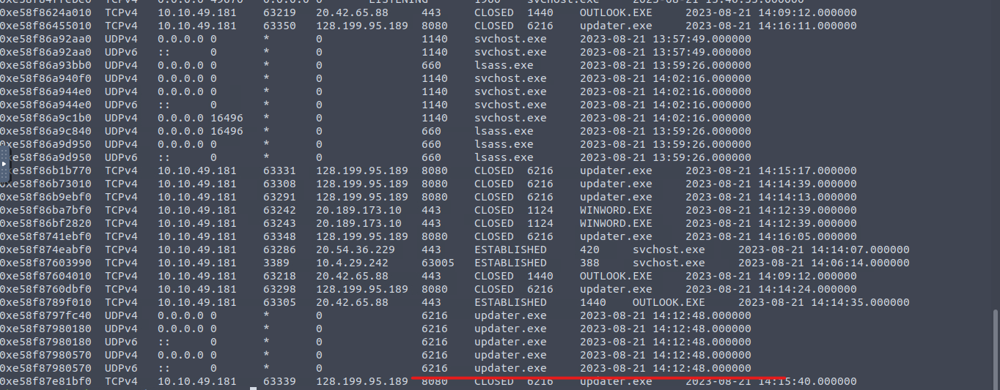
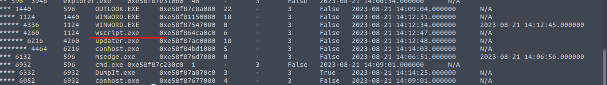
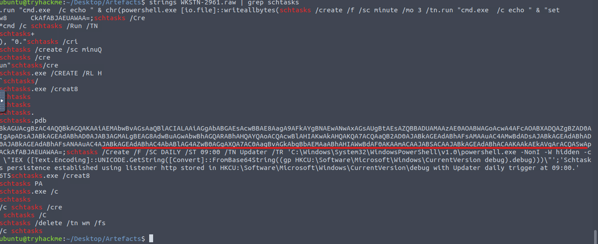
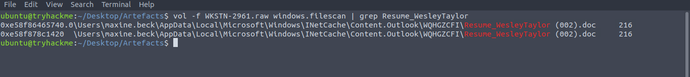

# Phishing Analysis & Memory Forensics
**Analyst:** Andy Dela Quarshie Wright  
**Role:** SOC Level 1 Analyst  
**Tools:** Thunderbird, olevba, oletools, Volatility, strings  
**Files Analysed:** Resume - Application for Junior IT Analyst Role.eml, Resume_WesleyTaylor.doc, WKSTN-2961.raw  

---

## Overview

End-to-end phishing investigation combining email analysis, malicious document inspection, and memory forensics. A phishing email disguised as a job application delivered a macro-enabled Word document to victim maxine.beck@quicklogisticsorg. The macro downloaded and executed malware, established C2 communication, and set up persistence via scheduled tasks.

---

## Incident Summary

| Field | Detail |
|-------|--------|
| Victim | maxine.beck@quicklogisticsorg.onmicrosoft.com |
| Sender | westaylor23@outlook.com |
| Subject | Resume - Application for Junior IT Analyst Role |
| Date | Sun, 20 Aug 2023 18:19:20 +0000 |
| Attachment | Resume_WesleyTaylor.doc |
| MD5 Hash | 52c4384a0b9e248b95804352ebec6c5b |
| C2 Domain | boogeymanisback.lol |
| C2 IP | 128.199.95.189 port 8080 |
| Persistence | Scheduled task Updater daily at 09:00 |
| Malicious process | updater.exe PID 6216 |

---

## Phase 1 — Phishing Email Analysis

### Phishing Email

Attacker posed as Wesley Taylor applying for a Junior IT Analyst role. Email contained Resume_WesleyTaylor.doc as attachment — a macro-enabled Word document.

---

### VBA Macro — olevba Analysis

AutoOpen macro executes on document open. Downloads payload from boogeymanisback.lol, saves as C:\ProgramData\update.js, executes via wscript.exe.

---

### Suspicious Keywords — oletools

oletools flagged: AutoOpen, Shell, WScript.Shell, CreateObject, Microsoft.XMLHTTP, Exec, Hex Strings, and confirmed IOC URL: https://files.boogeymanisback.lol/aa2a9c53cbb80416d3b47d85538d9971/update.png

---

### Artefacts and MD5 Hash

Files in artefacts folder: phishing .eml, WKSTN-2961.raw memory image, Resume_WesleyTaylor.doc. MD5: 52c4384a0b9e248b95804352ebec6c5b

---

## Phase 2 — Memory Forensics

### C2 Domain Confirmed in Memory

strings + grep confirmed boogeymanisback.lol present in memory including full payload URL and update.exe reference.

---

### Network Connections — netscan

updater.exe (PID 6216) made repeated connections to 128.199.95.189:8080 — confirmed C2 beaconing. OUTLOOK.EXE and WINWORD.EXE also show outbound connections consistent with the attack chain.

---

### Process Tree — pstree

Process chain: WINWORD.EXE (1124) → wscript.exe (4260) → updater.exe (6216). Confirms macro triggered wscript which spawned the malware payload.

---

### Persistence — Scheduled Task

Scheduled task Updater created — runs daily at 09:00 via PowerShell IEX from registry. Fileless persistence — payload stored in HKCU:\Software\Microsoft\Windows\CurrentVersion\debug.

---

### Malicious File Location — filescan

Resume_WesleyTaylor.doc found in maxine.beck Outlook INetCache — confirms file was opened directly from the phishing email.

---

## Attack Chain
---

## MITRE ATT&CK Mapping

| Technique | ID | Description |
|-----------|-----|-------------|
| Spearphishing Attachment | T1566.001 | Resume_WesleyTaylor.doc via email |
| User Execution | T1204.002 | Victim opens malicious Word document |
| VBA Macro | T1059.005 | AutoOpen macro executes on document open |
| Ingress Tool Transfer | T1105 | update.png downloaded from boogeymanisback.lol |
| Scheduled Task | T1053.005 | Updater task daily persistence |
| Fileless Execution | T1059.001 | PowerShell IEX from registry |
| Command and Control | T1071.001 | updater.exe beaconing to 128.199.95.189:8080 |

---

## Full Investigation

- [Phase 1 — Email & Document Analysis](investigation/phishing-analysis.md)
- [Phase 2 — Memory Forensics](memory-forensics/memory-analysis.md)
- [IOCs](iocs/iocs.md)

---

## Certifications

- CompTIA Security+
- TryHackMe SOC Level 1
- Google Cybersecurity Professional Certificate
